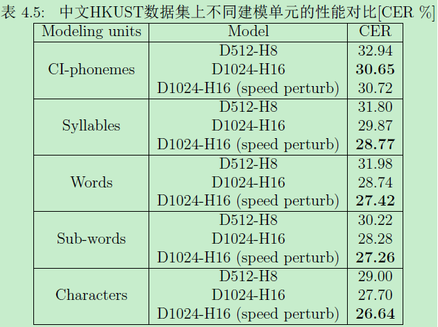
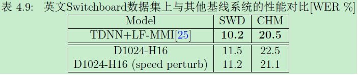
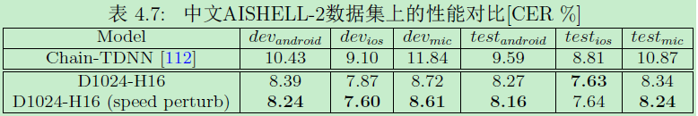
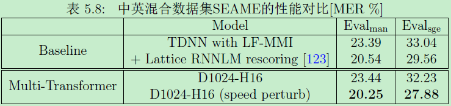
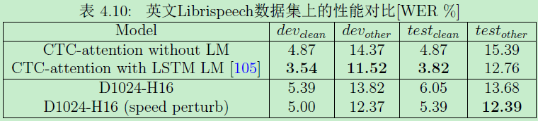

# ASR Transformer

This project is originally forked from <https://github.com/Kyubyong/transformer> and <https://github.com/chqiwang/transformer>.
We change it into ASR task. Five modeling units are compared on Mandarin Chinese ASR tasks with HKUST datasets by the ASR Transformer, including CI-phonemes, syllables, words, sub-words and characters.

## Usage
1)config your *.yaml; 2)python train.py; 3)python third_party/tensor2tensor/avg_checkpoints.py; 4)python evaluate.py

## Source Code for paper:
1)Zhou, S., Dong, L., Xu, S., & Xu, B. (2018). Syllable-Based Sequence-to-Sequence Speech Recognition with the Transformer in Mandarin Chinese. arXiv preprint arXiv:1804.10752.

2)Zhou, S., Dong, L., Xu, S., & Xu, B. (2018). A Comparison of Modeling Units in Sequence-to-Sequence Speech Recognition with the Transformer on Mandarin Chinese. arXiv preprint arXiv:1805.06239.

## Some results:

Contact
Raise an issue on github or email to zhoushiyu2013@ia.ac.cn.
